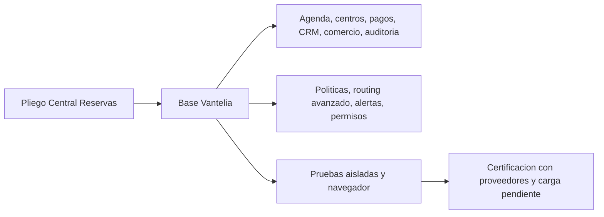
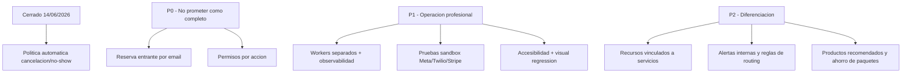

# Auditoria de cumplimiento - Central de Reservas

**Fecha:** 13 de junio de 2026  
**Fuente contractual:** `Detalle Central Reservas.pdf`  
**Criterio:** implementacion real, pruebas automatizadas, recorrido Chromium y comparacion con productos consolidados del sector.

## Veredicto ejecutivo

Vantelia dispone de una base funcional seria y supera claramente un MVP:
agenda determinista multicanal, multi-centro, profesionales, salas, CRM,
pagos Stripe, retenciones, reembolsos, comercio, recordatorios, auditoria e
informes.

No es correcto afirmar todavia que cumple **todos** los requisitos del PDF de
forma profesional. El cumplimiento actual es:

- **Completo o practicamente completo:** 8 areas (incluye ya la politica
  automatica de cancelacion/no-show por ventana temporal y por servicio,
  cerrada el 14/06/2026).
- **Parcial con una base funcional util:** 5 areas.
- **No implementado como lo pide el pliego:** reserva entrante por email y
  permisos configurables por accion.
- **Pendiente de certificacion real:** proveedores externos, carga,
  accesibilidad completa y recuperacion operativa.

## Matriz de cumplimiento

| Area del pliego | Estado | Evidencia actual | Brecha para considerarlo profesional |
|---|---|---|---|
| 1. Reservas web, WhatsApp, email y voz | **Parcial** | Web/widget, WhatsApp y voz comparten motor de agenda y evitan solapes. | Email es canal saliente, no canal conversacional entrante de reservas. Falta certificacion E2E real con Meta/Twilio y sincronizacion contractual con calendarios externos. |
| 2. Registro automatico de clientes | **Mayormente completo** | CRM crea y deduplica contactos por email/telefono sin cuenta del cliente final. | Falta un flujo dedicado de completar datos faltantes con reglas configurables por negocio. |
| 3. IA asigna salas/carriles y personal | **Parcial** | Asigna profesional disponible y sala libre; controla aforo y concurrencia. | Falta vincular recursos concretos a servicios, horarios propios de recurso y reglas configurables de reparto/equilibrado. |
| 4. Pagos, tarjeta retenida y gift cards | **Completo (salvo cert. sandbox)** | Stripe Connect, pago, deposito, porcentaje, preautorizacion, captura/liberacion, refund, gift cards y **politica automatica configurable de cancelacion/no-show** (aplica penalizacion/reembolso sobre el pago autorizado). | Solo pendiente pruebas contractuales periodicas en sandbox real de Stripe. |
| 5. Servicios, productos y paquetes | **Mayormente completo** | Servicios y precios/duracion por centro; productos; bonos multiservicio con precio descontado. | Falta asociar productos recomendados a servicios y calcular/mostrar automaticamente el ahorro del paquete. |
| 6. Recordatorios y confirmaciones | **Parcial** | Plantillas por evento, email/WhatsApp/SMS, botones WhatsApp y auditoria. | El routing se configura por plantilla, no aplica automaticamente la regla exacta del pliego segun canal de origen. |
| 7. Cancelaciones y reembolsos | **Completo** | Cancelacion auditada, motivos, captura de penalizacion y refund total/parcial, **mas motor de politica por ventana temporal y por servicio** que se aplica automaticamente en todos los canales (portal, voz, chat, WhatsApp, enlace de gestion). | Cubierto. El staff sigue pudiendo ajustar manualmente cualquier caso. |
| 8. Historial de actividad | **Mayormente completo** | Timeline de cita, CRM, filtros, exportaciones y auditoria de pagos/notificaciones. | Conviene unificar una busqueda transversal de actividad por cliente, fecha, servicio y actor. |
| 9. Panel de administracion | **Mayormente completo** | Agenda, empleados, centros, salas, servicios, bloqueos, usuarios y operacion manual. | Los workers viven con el proceso web; para operacion profesional deben separarse y monitorizarse. |
| 10. Dashboard | **Completo funcionalmente** | KPIs, graficos interactivos, ampliacion, CSV y filtros por centro, servicio y fechas. | Faltan informes programados, comparativas guardadas y objetivos configurables. |
| T1. Roles y permisos granulares | **Parcial** | Roles fijos `owner`, `manager`, `staff` aplicados en API y UI. | No se pueden asignar permisos por accion/modulo a cada usuario. |
| T2. Auditoria de acciones | **Mayormente completo** | Timeline de reservas, pagos, comercio, canales e impersonacion. | Falta catalogo formal que garantice auditoria para toda mutacion administrativa. |
| T3. Notificaciones y alertas | **Parcial** | Notificaciones a cliente y registro de envio/fallo. | Faltan bandeja de alertas internas, severidad, responsables, escalado y cierre. |

## Frontend

### Lo que ya es profesional

- Navegacion por roles, responsive y usable en escritorio/movil.
- Agenda visual, fichas laterales y flujos de alta/edicion dentro del portal.
- Estados de carga/error y feedback mediante `toast`.
- Informes con KPIs, filtros, tooltips y ampliacion de graficos.
- Consistencia visual razonable y controles de foco/reduccion de movimiento.

### Lo que impide calificarlo como frontend maduro

1. `app_ui/index.html` concentra estructura, estilos y logica de toda la SPA.
   Esto aumenta el riesgo de regresion y dificulta evolucionar por equipos.
2. La accesibilidad no esta certificada; varios controles visuales no nacen
   como elementos semanticos y faltan pruebas con teclado/lector de pantalla.
3. Persisten interacciones con `window.prompt`/`confirm`, inferiores a modales
   con contexto, validacion y resumen de impacto.
4. No hay pruebas visuales pixel a pixel ni matriz automatizada de movil,
   Safari/Firefox y distintos tamanos.
5. La densidad del menu y de algunas pantallas requiere personalizacion por
   rol/tarea y una busqueda global.

## Comparacion con referentes

Los referentes revisados muestran patrones que Vantelia debe adoptar:

- **Square Appointments:** recursos asignados a servicios, politicas de
  cancelacion/no-show, prepago y reporting de equipo.
- **Fresha:** recursos con disponibilidad propia y politica de pagos/no-show.
- **Mindbody:** operacion completa desde movil e informes filtrables por
  localizacion, servicio, categoria y estado.
- **Calendly:** formularios de cualificacion y routing basado en reglas.

Vantelia tiene una ventaja diferencial real en IA multicanal y un motor de
agenda comun. Para competir profesionalmente debe reforzar configurabilidad,
operacion y certificacion, no anadir mas pantallas sin cerrar esas bases.

Fuentes consultadas:

- [Square Appointments](https://squareup.com/us/en/appointments)
- [Recursos en Square Appointments](https://squareup.com/help/us/en/article/7065-square-appointments-resource-management)
- [Politicas de cancelacion en Square](https://squareup.com/help/us/en/article/5493-set-a-custom-cancellation-policy-with-square-appointments)
- [Fresha para negocios](https://www.fresha.com/for-business)
- [Recursos reservables de Fresha](https://www.fresha.com/blog/fresha-bookable-resources-feature)
- [Informes de Mindbody](https://support.mindbodyonline.com/s/article/203256053-Reports-explained)
- [Calendly Routing](https://calendly.com/scheduling/routing)

## Prioridad recomendada

## Cambio cerrado durante esta auditoria

El dashboard ya permite:

- Filtrar por centro.
- Filtrar por servicio.
- Elegir periodos rapidos de 7, 30 y 90 dias.
- Elegir fechas desde/hasta.
- Exportar CSV respetando centro, servicio y rango.
- Consultar graficos interactivos y ampliarlos.

Al filtrar por servicio, no se atribuyen productos, bonos o gift cards a ese
servicio sin una relacion contable explicita.

## Criterio de venta honesto

Vantelia puede presentarse hoy como una **central de reservas multicanal
avanzada en fase preproduccion/piloto controlado**. Para presentarla como
plataforma plenamente certificada para operacion diaria sin supervision deben
cerrarse los elementos P0 y P1 anteriores.
