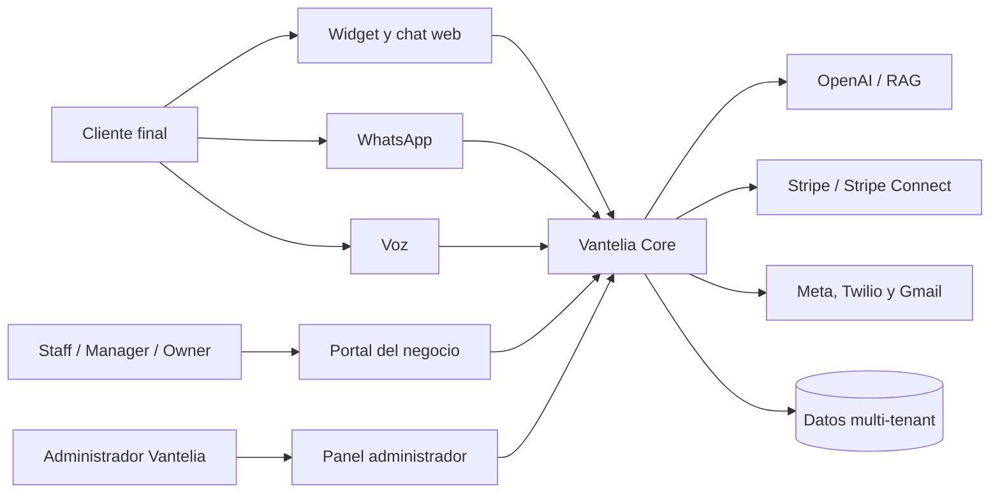
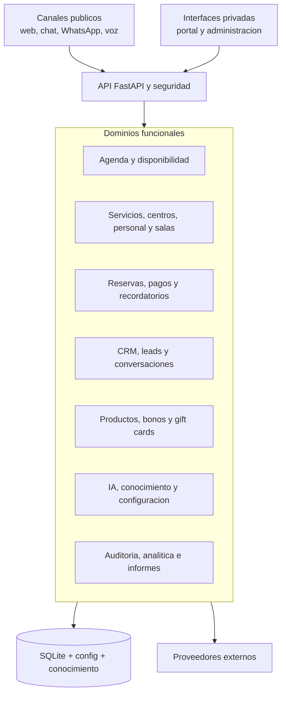
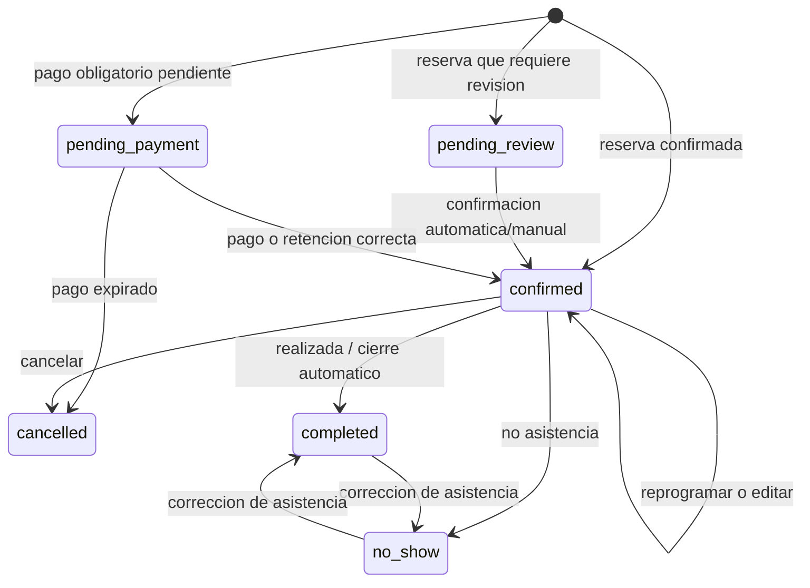
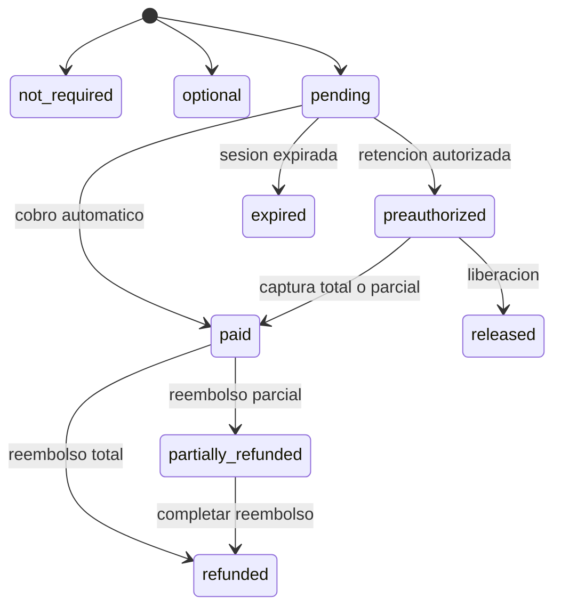
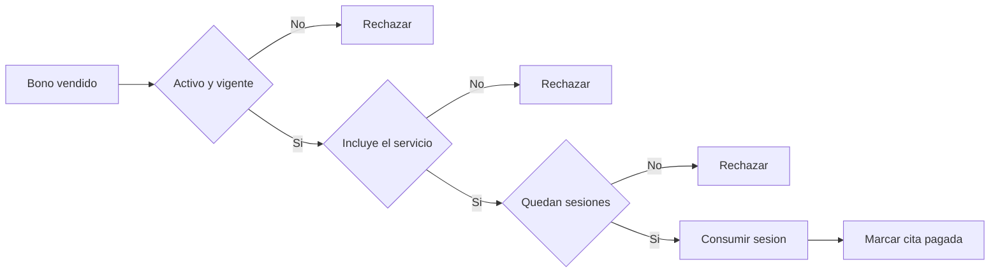
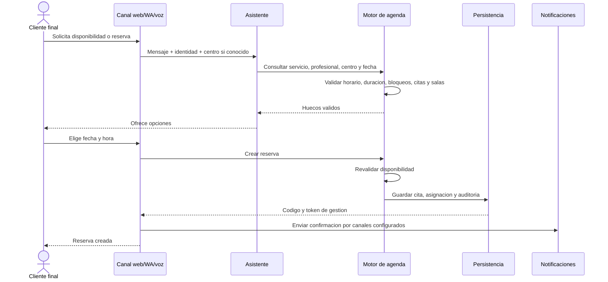
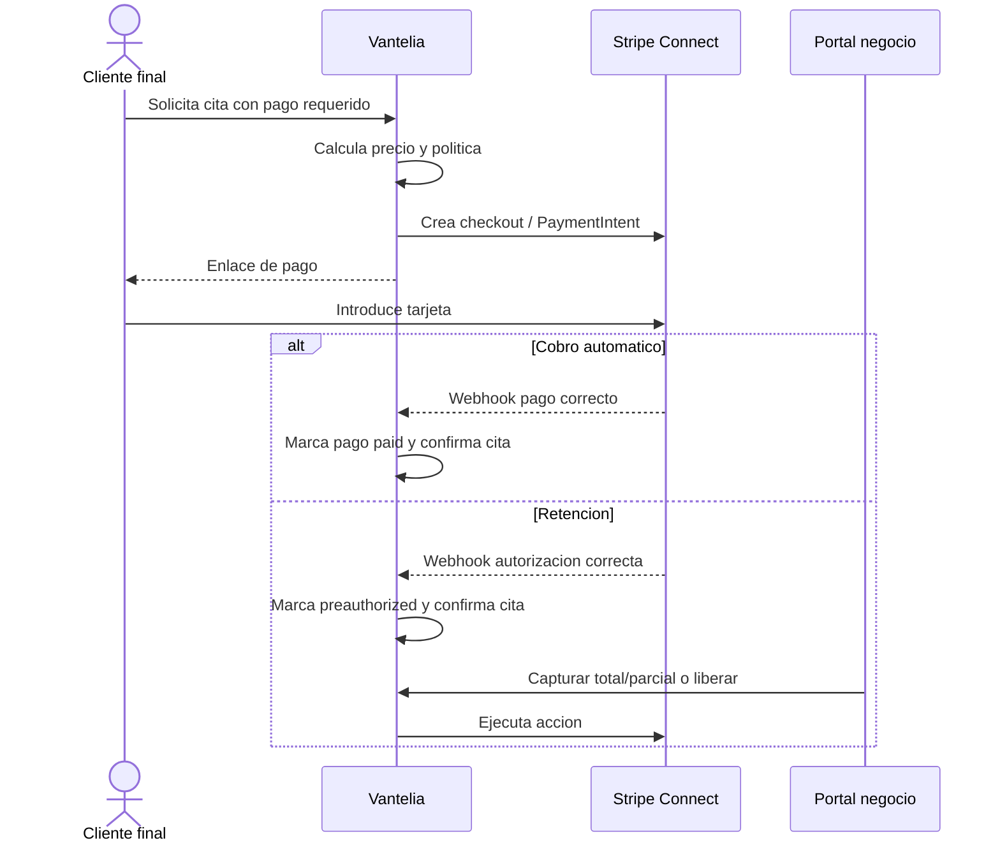
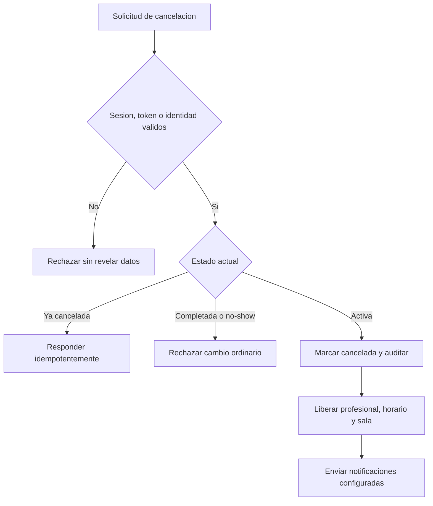
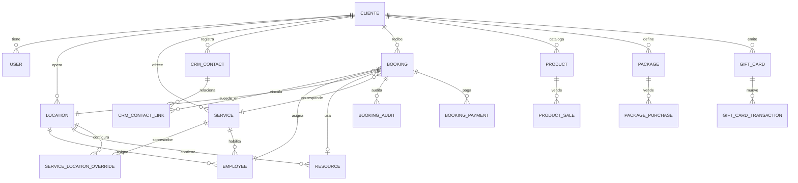

# Especificacion de requisitos funcionales de Vantelia

**Version:** 1.0  
**Fecha de referencia:** 13 de junio de 2026  
**Estado:** Especificacion del sistema actualmente implementado  
**Fuentes:** codigo, contratos API, esquema de datos y suite automatizada (`285 passed`)

---

## 1. Proposito

Este documento describe el comportamiento funcional que Vantelia ofrece en la
actualidad, las reglas de negocio que aplica y las principales casuisticas que
controla.

La especificacion sirve como:

- Referencia funcional para producto, desarrollo, QA y operaciones.
- Base para contratos, pliegos, historias de usuario y pruebas de aceptacion.
- Mapa de trazabilidad entre necesidades de negocio, comportamiento y pruebas.
- Punto de partida para evaluar cambios y evitar regresiones.

Los requisitos identificados como `RF-*` describen funciones observables. Las
reglas `RN-*` expresan restricciones de negocio. Los requisitos `RNF-*`
describen cualidades operativas o tecnicas.

## 2. Alcance actual

Vantelia es una plataforma SaaS multi-tenant que permite a cada negocio:

- Configurar un asistente de IA propio.
- Atender por widget web, chat web, WhatsApp y voz.
- Gestionar reservas, centros, profesionales, salas y servicios.
- Registrar contactos, leads, conversaciones y actividad.
- Gestionar pagos, retenciones, productos, bonos y tarjetas regalo.
- Enviar comunicaciones y recordatorios por varios canales.
- Operar mediante un portal privado con roles.
- Consultar auditoria, indicadores e informes por centro.

Vantelia tambien incluye un panel interno para alta de clientes, soporte,
operacion, demos, crecimiento y captacion comercial.

### 2.1 Fuera de alcance o limites actuales

- No se almacenan datos completos de tarjeta; Stripe procesa los pagos.
- No existe una politica automatica universal de penalizacion por cancelacion.
  La captura, liberacion y reembolso se deciden manualmente desde el panel.
- La retencion Stripe tiene una vigencia limitada por el proveedor,
  habitualmente cercana a siete dias.
- WhatsApp, voz, Gmail, SMS, Stripe y OpenAI dependen de servicios externos.
- La persistencia principal actual es SQLite; antes de alta concurrencia se
  recomienda migrar a PostgreSQL y workers externos.
- Las pruebas automatizadas simulan proveedores externos y no realizan cargos,
  llamadas o mensajes reales.

## 3. Actores

| Actor | Descripcion |
|---|---|
| Cliente final | Persona que conversa, consulta disponibilidad, reserva, paga o gestiona su cita. |
| Staff | Personal de recepcion o mostrador. Opera agenda, contactos, ventas y citas. |
| Manager | Encargado del negocio. Incluye permisos de staff y gestiona catalogos, centros, salas, profesionales e informes. |
| Owner | Propietario del negocio. Incluye permisos de manager y gestiona equipo de acceso, canales y conexiones sensibles. |
| Administrador Vantelia | Opera todos los tenants, altas, soporte, configuracion y captacion interna. |
| Asistente IA | Orquesta conversaciones y usa funciones deterministas de agenda y pagos. |
| Worker automatico | Ejecuta recordatorios, confirmaciones y cierres automaticos. |
| Proveedor externo | OpenAI, Stripe, Meta WhatsApp, Twilio, Gmail u otros servicios conectados. |

## 4. Diagrama de contexto



## 5. Arquitectura funcional



## 6. Requisitos funcionales

### 6.1 Multi-tenant, identidad y acceso

| ID | Requisito funcional |
|---|---|
| RF-ACC-001 | El sistema debe aislar configuracion, usuarios, contactos, citas, centros, pagos, canales y datos de negocio mediante `cliente_id`. |
| RF-ACC-002 | El sistema debe permitir autenticacion por email y contrasena mediante sesion privada. |
| RF-ACC-003 | El sistema debe permitir alta self-service cuando la funcion este habilitada. |
| RF-ACC-004 | El sistema debe permitir inicio o vinculacion mediante Google OAuth cuando este configurado. |
| RF-ACC-005 | El usuario debe poder cambiar su contrasena y solicitar recuperacion mediante token temporal. |
| RF-ACC-006 | El owner debe poder crear, editar, activar, desactivar y eliminar miembros de su equipo. |
| RF-ACC-007 | El sistema debe aplicar la jerarquia `staff < manager < owner`. |
| RF-ACC-008 | El sistema debe impedir eliminar, desactivar o degradar al ultimo owner activo. |
| RF-ACC-009 | El administrador Vantelia debe poder impersonar de forma auditada a un cliente con permisos equivalentes a owner. |
| RF-ACC-010 | El sistema debe aplicar limites funcionales segun el plan contratado. |

### 6.2 Asistente IA y conocimiento

| ID | Requisito funcional |
|---|---|
| RF-IA-001 | Cada negocio debe disponer de un cerebro y configuracion independientes. |
| RF-IA-002 | El portal debe permitir editar nombre, bienvenida, icono, colores, logo, tono e instrucciones adicionales. |
| RF-IA-003 | El portal debe permitir anadir conocimiento mediante texto y URL. |
| RF-IA-004 | El portal debe permitir crear, editar y borrar preguntas frecuentes. |
| RF-IA-005 | El sistema debe permitir reindexar el conocimiento del negocio. |
| RF-IA-006 | El asistente debe responder usando el conocimiento y limites del tenant correspondiente. |
| RF-IA-007 | El asistente debe detectar intenciones de reserva, disponibilidad, cancelacion, reprogramacion y pago. |
| RF-IA-008 | El asistente no debe inventar disponibilidad; debe consultar el motor determinista de agenda. |
| RF-IA-009 | El asistente debe considerar servicio, duracion, centro y profesional al consultar huecos. |
| RF-IA-010 | El prompt debe incluir los centros disponibles y solicitar eleccion cuando el centro no sea inequivoco. |
| RF-IA-011 | Las conversaciones deben guardarse por tenant, sesion, canal, mensajes e intencion. |
| RF-IA-012 | Si OpenAI no esta disponible, la agenda publica debe seguir funcionando sin IA. |

### 6.3 Canales

| ID | Requisito funcional |
|---|---|
| RF-CAN-001 | El cliente final debe poder interactuar mediante widget/chat web. |
| RF-CAN-002 | El cliente final debe poder interactuar mediante WhatsApp Cloud API. |
| RF-CAN-003 | El cliente final debe poder interactuar mediante llamada de voz Twilio/OpenAI Realtime. |
| RF-CAN-004 | Web, WhatsApp y voz deben usar las mismas reglas de agenda, servicios, centros y disponibilidad. |
| RF-CAN-005 | Un numero entrante de WhatsApp o voz asociado a un centro debe limitar la interaccion a dicho centro. |
| RF-CAN-006 | WhatsApp debe verificar el webhook y, si esta configurado, su firma. |
| RF-CAN-007 | Voz debe verificar la firma Twilio para llamadas entrantes. |
| RF-CAN-008 | Las conversaciones WhatsApp deben aparecer en el historial comun del tenant. |
| RF-CAN-009 | Los canales no configurados deben informar del fallo sin corromper la cita. |
| RF-CAN-010 | La apariencia del widget debe ser configurable por negocio y restringirse a dominios autorizados. |

> Nota: actualmente email es un canal de comunicacion y confirmacion, no un
> canal conversacional completo de reserva entrante equivalente a web,
> WhatsApp o voz.

### 6.4 Centros, profesionales y salas

| ID | Requisito funcional |
|---|---|
| RF-ORG-001 | Un negocio debe poder operar con uno o varios centros. |
| RF-ORG-002 | Cada centro debe poder almacenar nombre, direccion, telefono, zona horaria, numero WhatsApp y numero de voz. |
| RF-ORG-003 | Debe existir un centro principal que no pueda eliminarse ni desactivarse. |
| RF-ORG-004 | Un profesional debe pertenecer a un centro y poder ofrecer uno, varios o todos los servicios. |
| RF-ORG-005 | Cada profesional debe poder tener horario, rejilla, descansos y dias cerrados propios. |
| RF-ORG-006 | El sistema debe permitir activar, desactivar y eliminar profesionales no principales. |
| RF-ORG-007 | El sistema debe impedir desactivar o eliminar un profesional con citas futuras activas. |
| RF-ORG-008 | El sistema debe impedir desactivar o eliminar un centro con profesionales asignados. |
| RF-ORG-009 | Un centro debe poder tener cero o varias salas/recursos activos. |
| RF-ORG-010 | Sin salas configuradas, el centro no debe aplicar limite de aforo por recurso. |
| RF-ORG-011 | Con salas configuradas, el numero maximo de citas solapadas debe ser el numero de salas activas disponibles. |
| RF-ORG-012 | Cada cita debe guardar la sala asignada cuando proceda. |
| RF-ORG-013 | El sistema debe impedir desactivar o eliminar una sala asignada a citas futuras activas. |

### 6.5 Servicios y catalogo

| ID | Requisito funcional |
|---|---|
| RF-SER-001 | Manager y owner deben poder crear, editar, listar, activar, desactivar y eliminar servicios. |
| RF-SER-002 | Cada servicio debe disponer de nombre, descripcion, precio base y duracion base. |
| RF-SER-003 | El sistema debe impedir nombres de servicio duplicados dentro del mismo tenant. |
| RF-SER-004 | Un servicio inactivo no debe aparecer ni poder reservarse por canales publicos. |
| RF-SER-005 | Con mas de un centro, el editor debe mostrar disponibilidad y precio por centro. |
| RF-SER-006 | Por centro se debe poder desactivar el servicio o sobrescribir precio y duracion. |
| RF-SER-007 | Un valor de override vacio debe heredar el valor base. |
| RF-SER-008 | Eliminar el override debe restaurar disponibilidad, precio y duracion heredados. |
| RF-SER-009 | La cita debe guardar el precio y duracion efectivos del centro seleccionado. |
| RF-SER-010 | Una peticion directa no debe poder reservar un servicio desactivado para el centro o profesional. |
| RF-SER-011 | El sistema debe resolver servicios ignorando diferencias razonables de acentos y normalizacion textual. |
| RF-SER-012 | El servicio puede definir politica de pago y tipo de cobro. |

### 6.6 Agenda y disponibilidad

| ID | Requisito funcional |
|---|---|
| RF-AGE-001 | El sistema debe calcular huecos por fecha, servicio, profesional y centro. |
| RF-AGE-002 | El calculo debe considerar zona horaria, inicio y fin de jornada, rejilla, descansos, dias cerrados y bloqueos. |
| RF-AGE-003 | El calculo debe considerar la duracion efectiva completa del servicio, no solo su hora de inicio. |
| RF-AGE-004 | El sistema no debe ofrecer horas pasadas del dia actual. |
| RF-AGE-005 | El sistema debe rechazar fechas pasadas y fechas posteriores al limite de antelacion. |
| RF-AGE-006 | El sistema debe rechazar horas que no pertenezcan a la rejilla del profesional. |
| RF-AGE-007 | Dos citas del mismo profesional no deben solaparse. |
| RF-AGE-008 | Dos profesionales distintos pueden atender simultaneamente si existe capacidad de sala. |
| RF-AGE-009 | Dos centros distintos deben operar con capacidad independiente. |
| RF-AGE-010 | Los limites adyacentes deben permitirse: una cita puede comenzar exactamente cuando termina otra. |
| RF-AGE-011 | Deben poder crearse bloqueos parciales, completos y por rango de fechas. |
| RF-AGE-012 | Crear dos veces el mismo bloqueo debe ser idempotente. |
| RF-AGE-013 | El sistema debe impedir crear un bloqueo que colisione con citas activas. |
| RF-AGE-014 | El sistema debe impedir anadir un descanso que colisione con citas activas. |
| RF-AGE-015 | El sistema debe impedir cerrar un dia que contiene citas futuras activas. |
| RF-AGE-016 | El sistema debe impedir recortar el horario dejando citas futuras fuera de jornada. |
| RF-AGE-017 | Los conflictos de cambio de horario deben devolver las citas afectadas para facilitar su resolucion. |
| RF-AGE-018 | Cancelar una cita debe liberar inmediatamente profesional, horario y sala. |

### 6.7 Reservas

| ID | Requisito funcional |
|---|---|
| RF-RES-001 | El cliente final debe poder reservar desde web/widget, WhatsApp y voz. |
| RF-RES-002 | Staff, manager y owner deben poder crear reservas manuales desde el portal. |
| RF-RES-003 | Toda reserva debe validar de nuevo disponibilidad justo antes de persistirse. |
| RF-RES-004 | La reserva debe guardar cliente, contacto, servicio, precio, duracion, profesional, centro, sala, origen y zona horaria. |
| RF-RES-005 | La reserva debe generar un codigo identificable y un token seguro de gestion. |
| RF-RES-006 | El cliente final debe poder consultar, editar, cancelar y reprogramar mediante su token de gestion. |
| RF-RES-007 | El portal debe permitir cancelar, reprogramar, editar y marcar asistencia. |
| RF-RES-008 | WhatsApp y chat deben permitir cancelar o reprogramar mediante codigo cuando se verifica la identidad de contacto. |
| RF-RES-009 | La cancelacion repetida debe ser idempotente. |
| RF-RES-010 | Una reprogramacion debe rechazar huecos ocupados o invalidos. |
| RF-RES-011 | El sistema debe permitir marcar una cita como realizada o no-show. |
| RF-RES-012 | Las citas pasadas confirmadas deben poder marcarse automaticamente como completadas. |
| RF-RES-013 | Cada cambio relevante debe quedar registrado en el timeline de auditoria. |

### 6.8 Estados de reserva



Estados activos que ocupan agenda: `confirmed`, `pending_review` y
`pending_payment`.

### 6.9 Pagos de citas y Stripe Connect

| ID | Requisito funcional |
|---|---|
| RF-PAG-001 | Cada negocio debe poder conectar su propia cuenta Stripe Connect. |
| RF-PAG-002 | Cada servicio debe poder configurar `none`, pago completo, senal fija, senal porcentual o retencion. |
| RF-PAG-003 | El importe debe calcularse desde el servicio y su politica, nunca desde texto libre del cliente final. |
| RF-PAG-004 | El sistema debe crear enlaces de pago en la cuenta conectada del negocio. |
| RF-PAG-005 | Un pago obligatorio pendiente debe poder mantener la cita en `pending_payment`. |
| RF-PAG-006 | Un webhook de pago correcto debe confirmar la cita de forma idempotente. |
| RF-PAG-007 | La expiracion de un pago obligatorio debe cancelar o liberar la cita segun su estado. |
| RF-PAG-008 | La retencion debe autorizar el importe sin capturarlo inmediatamente. |
| RF-PAG-009 | El portal debe permitir capturar total o parcialmente una retencion. |
| RF-PAG-010 | El portal debe permitir liberar una retencion. |
| RF-PAG-011 | El portal debe permitir reembolsar total o parcialmente pagos capturados. |
| RF-PAG-012 | Capturas, liberaciones y reembolsos deben aceptar un motivo opcional y quedar auditados. |
| RF-PAG-013 | Una cita ya pagada no debe admitir un segundo pago, bono o gift card. |
| RF-PAG-014 | Los webhooks Stripe deben ser idempotentes. |



### 6.10 Envio de enlaces de pago por IA

| ID | Requisito funcional |
|---|---|
| RF-AIP-001 | El owner debe activar explicitamente el envio de enlaces por IA. |
| RF-AIP-002 | El envio debe requerir Stripe conectado y cobros habilitados. |
| RF-AIP-003 | El enlace solo debe enviarse al contacto ya registrado en la cita. |
| RF-AIP-004 | Para citas de voz se debe usar SMS; para el resto se debe usar email. |
| RF-AIP-005 | Si falta el canal requerido, no se debe crear ni enviar el enlace. |
| RF-AIP-006 | Si la cita ya esta pagada, no se debe reenviar. |
| RF-AIP-007 | Se deben permitir como maximo dos enlaces por cita durante una hora. |
| RF-AIP-008 | El envio debe quedar auditado. |
| RF-AIP-009 | La IA debe identificar la cita mediante codigo, telefono verificado o contacto aportado; si no puede, debe solicitar identificacion. |

### 6.11 CRM, leads y conversaciones

| ID | Requisito funcional |
|---|---|
| RF-CRM-001 | Reservas, leads, WhatsApp y voz deben crear o actualizar contactos automaticamente. |
| RF-CRM-002 | La deduplicacion debe priorizar email normalizado y despues telefono normalizado, siempre dentro del tenant. |
| RF-CRM-003 | El sistema no debe fusionar automaticamente contactos solo por nombre. |
| RF-CRM-004 | El portal debe permitir crear, consultar y editar contactos. |
| RF-CRM-005 | El contacto debe mostrar actividad vinculada: leads, citas, chats y llamadas. |
| RF-CRM-006 | El portal debe permitir filtrar, ordenar, paginar y exportar contactos. |
| RF-CRM-007 | Los filtros deben incluir busqueda, estado, etiqueta, responsable, origen, proxima accion y actividad. |
| RF-CRM-008 | Una cita realizada debe convertir el contacto a estado `cliente`. |
| RF-CRM-009 | El sistema debe permitir registrar y exportar leads. |
| RF-CRM-010 | El listado debe evitar cargar detalles pesados hasta abrir la ficha. |

Estados CRM: `nuevo`, `interesado`, `cita_pendiente`, `confirmado`, `cliente`
y `perdido`.

### 6.12 Productos, bonos y tarjetas regalo

| ID | Requisito funcional |
|---|---|
| RF-COM-001 | Manager y owner deben poder gestionar catalogo de productos. |
| RF-COM-002 | Staff debe poder vender productos desde mostrador. |
| RF-COM-003 | Una venta debe descontar stock y rechazar cantidades superiores al disponible. |
| RF-COM-004 | Manager y owner deben poder crear bonos con sesiones por servicio, precio y caducidad. |
| RF-COM-005 | Staff debe poder vender y redimir bonos. |
| RF-COM-006 | Un bono solo debe aplicarse a servicios incluidos y con sesiones restantes. |
| RF-COM-007 | Un bono agotado, inactivo o caducado debe rechazarse. |
| RF-COM-008 | Staff debe poder emitir y redimir tarjetas regalo. |
| RF-COM-009 | La tarjeta regalo debe permitir pago total o parcial y actualizar saldo. |
| RF-COM-010 | Una tarjeta inexistente, desactivada, agotada o caducada debe rechazarse. |
| RF-COM-011 | Redimir un bono o gift card que cubra la cita debe marcarla como pagada. |
| RF-COM-012 | Las operaciones deben asociarse al centro cuando se indique y alimentar informes. |



### 6.13 Comunicaciones y recordatorios

| ID | Requisito funcional |
|---|---|
| RF-NOT-001 | El sistema debe enviar comunicaciones de confirmacion, cancelacion, reprogramacion y recordatorio. |
| RF-NOT-002 | El negocio debe poder configurar plantillas y canales por tipo de mensaje. |
| RF-NOT-003 | Los canales disponibles son email, WhatsApp y SMS segun configuracion. |
| RF-NOT-004 | Los recordatorios deben poder ejecutarse automaticamente a 24 h y 2 h. |
| RF-NOT-005 | Los mensajes WhatsApp deben poder incluir botones de confirmar y cancelar. |
| RF-NOT-006 | La respuesta a botones debe actualizar la cita de manera segura. |
| RF-NOT-007 | El portal debe permitir previsualizar y enviar mensajes de prueba. |
| RF-NOT-008 | El envio o fallo por canal debe quedar auditado. |
| RF-NOT-009 | Gmail conectado debe usarse antes que SMTP si asi se configura. |
| RF-NOT-010 | Los secretos OAuth y credenciales de canal deben almacenarse cifrados. |
| RF-NOT-011 | Un remitente SMS arbitrario no provisionado no debe utilizarse. |

### 6.14 Auditoria, informes y exportaciones

| ID | Requisito funcional |
|---|---|
| RF-INF-001 | Cada cita debe disponer de timeline de eventos. |
| RF-INF-002 | El timeline debe registrar creacion, cambios, cancelacion, asistencia, pagos, bonos, gift cards y notificaciones. |
| RF-INF-003 | El sistema debe registrar auditoria de contactos, canales e impersonaciones. |
| RF-INF-004 | Manager y owner deben poder consultar informes con indicadores y graficos. |
| RF-INF-005 | Los informes deben poder filtrarse por centro, servicio y rango temporal. |
| RF-INF-006 | Los ingresos de productos, bonos y gift cards deben atribuirse al centro correspondiente. |
| RF-INF-007 | El sistema debe permitir exportar CSV de citas, contactos, leads e informes aplicando filtros. |
| RF-INF-008 | El administrador debe poder consultar analitica global y estado operativo. |

### 6.15 Onboarding, administracion y demos

| ID | Requisito funcional |
|---|---|
| RF-ADM-001 | El alta self-service debe crear usuario owner, tenant y suscripcion inicial. |
| RF-ADM-002 | El onboarding debe permitir aprender desde una web y configurar personalidad. |
| RF-ADM-003 | El administrador debe poder crear, editar, asignar owner y eliminar clientes. |
| RF-ADM-004 | El administrador debe poder generar una alta express desde una web publica. |
| RF-ADM-005 | El sistema debe generar enlaces demo y snippets de instalacion. |
| RF-ADM-006 | El administrador debe poder generar y purgar agendas demo. |
| RF-ADM-007 | Las demos reclamables deben poder transferirse a un usuario valido. |
| RF-ADM-008 | El sistema debe exponer paginas legales publicas. |
| RF-ADM-009 | El administrador debe poder operar herramientas internas de growth y captacion. |

### 6.16 Suscripciones y facturacion SaaS

| ID | Requisito funcional |
|---|---|
| RF-BIL-001 | El sistema debe ofrecer planes y limites de uso configurables. |
| RF-BIL-002 | Un usuario self-service debe poder iniciar checkout de suscripcion mediante Stripe. |
| RF-BIL-003 | El webhook Stripe SaaS debe activar o actualizar cliente y suscripcion de forma idempotente. |
| RF-BIL-004 | El owner debe poder abrir el portal de facturacion de Stripe cuando exista suscripcion compatible. |
| RF-BIL-005 | El portal debe mostrar plan actual, estado, limites y consumo aplicable. |
| RF-BIL-006 | El sistema debe aplicar limites de plan a profesionales, usuarios, documentos, mensajes, reservas y canales cuando correspondan. |
| RF-BIL-007 | El sistema debe restablecer cuotas periodicas al cambiar el periodo de facturacion. |
| RF-BIL-008 | Las suscripciones lifetime no deben depender de sincronizacion periodica con Stripe. |
| RF-BIL-009 | Si Stripe SaaS no esta configurado, el portal debe informar el estado y rechazar checkout sin afectar las funciones disponibles. |

### 6.17 Growth y captacion interna

Estas funciones pertenecen al panel interno de Vantelia y no al portal ordinario
de cada negocio.

| ID | Requisito funcional |
|---|---|
| RF-GRO-001 | El administrador debe poder registrar actividad diaria, oportunidades, tareas y revisiones semanales de growth. |
| RF-GRO-002 | Cada oportunidad debe disponer de etapa, siguiente accion, fechas, notas e historial de cambios. |
| RF-GRO-003 | El sistema debe calcular indicadores y umbrales del plan de crecimiento. |
| RF-GRO-004 | El administrador debe poder importar, consultar, filtrar, editar, suprimir y exportar prospectos de outreach. |
| RF-GRO-005 | El sistema debe permitir plantillas, previews, campanas, follow-ups, tracking de apertura/click/respuesta y cola de aprobacion. |
| RF-GRO-006 | El autopiloto de outreach debe respetar configuracion, limites de contacto, supresiones y estado de campana. |
| RF-GRO-007 | El administrador debe poder gestionar prospectos, borradores, plantillas, campanas y envio asistido para Instagram. |
| RF-GRO-008 | El administrador debe poder gestionar campanas, plantillas y envio asistido para TikTok. |
| RF-GRO-009 | El administrador debe poder configurar y operar captacion saliente por WhatsApp. |
| RF-GRO-010 | Los envios, respuestas, contactos manuales y cambios relevantes deben quedar en timeline o log operativo. |
| RF-GRO-011 | Las listas de supresion deben impedir nuevos contactos por el canal correspondiente. |
| RF-GRO-012 | Las funciones de captacion deben estar protegidas por autenticacion administrativa. |

## 7. Reglas de negocio y casuisticas controladas

### 7.1 Matriz de disponibilidad

| Caso | Resultado esperado |
|---|---|
| Fecha pasada | Rechazar. |
| Hora pasada del dia actual | No ofrecer y rechazar reserva directa. |
| Dia cerrado global o del profesional | No ofrecer y rechazar. |
| Antes del inicio o en/despues del fin de jornada | No ofrecer y rechazar. |
| Hora fuera de rejilla | Rechazar. |
| Servicio que invade un descanso | No ofrecer y rechazar. |
| Servicio que invade un bloqueo | No ofrecer y rechazar. |
| Servicio que invade otra cita | No ofrecer y rechazar. |
| Servicio que termina justo al empezar otra cita | Permitir. |
| Servicio que empieza justo al terminar otra cita | Permitir. |
| Mismo horario con otro profesional y capacidad libre | Permitir. |
| Mismo horario en otro centro | Permitir. |
| Mismo centro sin sala libre | Rechazar. |
| Servicio inactivo globalmente | No mostrar y rechazar. |
| Servicio no disponible en el centro/profesional | No mostrar y rechazar, incluso por peticion manipulada. |
| Cancelacion de cita | Liberar inmediatamente horario y sala. |
| Carrera o doble reserva | Solo una operacion puede ocupar el recurso; la otra recibe conflicto. |

### 7.2 Ejemplo de duracion solicitado y verificado

Situacion: existe una cita a las `10:30`.

| Peticion | Resultado |
|---|---|
| Servicio de 45 min a las 10:00 | Rechazado: termina a las 10:45 y solapa. |
| Servicio de 15 min a las 10:00 | Permitido: termina a las 10:15. |
| Servicio de 15 min a las 10:15 | Permitido: termina exactamente a las 10:30. |
| Servicio de 15 min a las 10:30 | Rechazado: el inicio esta ocupado. |
| Servicio de 45 min a las 10:45 | Permitido si la cita anterior ya ha terminado. |

### 7.3 Reglas de integridad administrativa

| ID | Regla |
|---|---|
| RN-ADM-001 | No se puede eliminar o desactivar el centro principal. |
| RN-ADM-002 | No se puede desactivar un centro con profesionales asignados. |
| RN-ADM-003 | No se puede eliminar o desactivar un profesional con citas futuras activas. |
| RN-ADM-004 | No se puede eliminar o desactivar una sala con citas futuras activas. |
| RN-ADM-005 | No se puede introducir un descanso, cierre o recorte horario sobre citas futuras activas. |
| RN-ADM-006 | No se puede crear o renombrar un servicio con el nombre de otro servicio del tenant. |
| RN-ADM-007 | No se puede eliminar, desactivar o degradar al ultimo owner activo. |

### 7.4 Reglas de pagos y comercio

| ID | Regla |
|---|---|
| RN-PAG-001 | El importe de una cita se toma del precio efectivo del servicio y centro. |
| RN-PAG-002 | Una cita pagada no puede cobrarse de nuevo mediante Stripe, bono o tarjeta regalo. |
| RN-PAG-003 | Un bono solo consume sesiones del servicio incluido. |
| RN-PAG-004 | Bonos y tarjetas caducados o inactivos se rechazan. |
| RN-PAG-005 | Una gift card parcial reduce saldo, registra transaccion y no marca la cita pagada si queda importe pendiente. |
| RN-PAG-006 | Una retencion solo puede capturarse o liberarse mientras esta preautorizada. |
| RN-PAG-007 | Solo pagos cobrados o parcialmente reembolsados pueden reembolsarse. |
| RN-PAG-008 | El envio IA de enlaces es opt-in, usa identidad verificada y aplica rate limit. |

### 7.5 Reglas de seguridad multicanal

| ID | Regla |
|---|---|
| RN-SEG-001 | Toda operacion privada debe comprobar sesion, tenant y rol. |
| RN-SEG-002 | Los endpoints admin deben exigir token o sesion administrativa. |
| RN-SEG-003 | El widget debe validar el origen autorizado del cliente. |
| RN-SEG-004 | Tokens de gestion invalidos no deben revelar citas. |
| RN-SEG-005 | Cancelaciones, reprogramaciones y pagos conversacionales deben verificar codigo o identidad del canal. |
| RN-SEG-006 | Los secretos de canales y tokens OAuth deben almacenarse cifrados. |
| RN-SEG-007 | Los webhooks externos deben validar firma cuando el proveedor lo permite. |

## 8. Matriz de permisos

Leyenda: `L` lectura, `O` operacion, `G` gestion, `-` no permitido.

| Capacidad | Staff | Manager | Owner | Admin Vantelia |
|---|---:|---:|---:|---:|
| Ver y operar agenda/citas | O | O | O | G |
| Crear reserva manual | O | O | O | G |
| Contactos, leads y conversaciones | O | O | O | G |
| Vender productos, bonos y gift cards | O | O | O | G |
| Gestionar catalogo de productos/bonos | - | G | G | G |
| Gestionar servicios y overrides | - | G | G | G |
| Gestionar centros, salas y profesionales | - | G | G | G |
| Consultar informes | - | L | L | G |
| Gestionar equipo de acceso | - | - | G | G |
| Gestionar Gmail/SMS/Stripe sensible | - | - | G | G |
| Impersonar tenants | - | - | - | G |

## 9. Flujos principales

### 9.1 Reserva multicanal



### 9.2 Reserva con pago o retencion



### 9.3 Cancelacion y liberacion de capacidad



## 10. Modelo conceptual de datos



Entidades persistidas principales:

- Identidad y tenant: `clientes`, `users`, `auth_sessions`, `subscriptions`.
- Agenda: `locations`, `employees`, `resources`, `services`,
  `service_location_overrides`, `agenda_blocks`, `bookings`, `booking_audit`.
- Pagos: `booking_payments`, `client_payment_accounts`,
  `service_payment_policies`, `customer_payments`, `customer_payment_events`.
- CRM: `crm_contacts`, `crm_contact_links`, `crm_contact_audit`, `bot_leads`.
- Conversacion: `chat_sessions`, `chat_messages`, `voice_calls`,
  `whatsapp_inbound_messages`.
- Comercio: `products`, `product_sales`, `packages`, `package_purchases`,
  `gift_cards`, `gift_card_transactions`.
- Conocimiento y canales: `kb_documents`, `kb_qa`,
  `client_channel_settings`, `client_channel_audit`.

## 11. Requisitos no funcionales

| ID | Requisito no funcional |
|---|---|
| RNF-001 | El sistema debe mantener aislamiento multi-tenant en consultas y mutaciones. |
| RNF-002 | Las operaciones sensibles deben aplicar autenticacion, autorizacion y proteccion CSRF/origin cuando proceda. |
| RNF-003 | Los secretos persistidos deben cifrarse y nunca exponerse en respuestas publicas. |
| RNF-004 | Los webhooks, cancelaciones repetidas, bloqueos duplicados y eventos de pago deben ser idempotentes. |
| RNF-005 | La agenda debe seguir disponible aunque OpenAI no este configurado. |
| RNF-006 | El fallo de un canal de notificacion no debe corromper la reserva. |
| RNF-007 | El sistema debe exponer `/health` con estado de configuracion, datos, almacenamiento, base de datos y bundle. |
| RNF-008 | El despliegue debe conservar secretos, configuracion y datos productivos, y mantener una version anterior para rollback. |
| RNF-009 | La aplicacion debe ejecutarse en Docker y reconstruirse de forma reproducible. |
| RNF-010 | El widget debe generarse mediante build reproducible. |
| RNF-011 | Las operaciones relevantes deben quedar auditadas con fecha, actor y contexto. |
| RNF-012 | Los listados de volumen deben usar paginacion y evitar consultas N+1 conocidas. |
| RNF-013 | Los datos temporales deben expresarse en UTC y mostrarse segun la zona horaria aplicable. |
| RNF-014 | Antes de desplegar, la suite automatizada, compilacion Python y build del widget deben finalizar correctamente. |

## 12. Trazabilidad y evidencia de aceptacion

| Area | Evidencia principal |
|---|---|
| Agenda y limites temporales | `tests/test_booking_exhaustive.py` |
| Reserva multicanal, duraciones, centros y salas | `tests/test_reservas_multicanal_e2e.py` |
| Pliego completo, roles, comercio, informes y auditoria | `tests/test_pliego_acceptance_e2e.py` |
| Integridad administrativa y casos negativos | `tests/test_admin_edge_cases_e2e.py` |
| CRM y Stripe Connect | `tests/test_crm_light.py` |
| Canales Gmail/SMS y cifrado | `tests/test_client_channels.py` |
| Enlaces de pago por IA | `tests/test_ai_payment_link.py` |
| Funcionalidad general, seguridad, onboarding y administracion | `tests/test_api_smoke.py` |
| Recorrido real del portal | `scripts/qa_portal_browser.py` |
| Recorrido E2E aislado | `scripts/qa_e2e.py` |
| Informe funcional detallado | `docs/QA_RESERVAS_MULTICANAL_2026-06-12.md` |

Estado de validacion en la fecha de referencia:

```text
Suite automatizada: 285 passed, 0 failed
QA E2E portal:      66 PASS, 0 WARN, 0 BUG
Navegador Chromium: PASS
Widget build:       OK
Produccion /health: OK
```

## 13. Criterios de regresion obligatorios

Un cambio no debe considerarse aceptado si incumple cualquiera de estos puntos:

1. Permite reservar un intervalo que solapa una cita, descanso, bloqueo o limite
   de sala.
2. Produce resultados de disponibilidad diferentes entre web, WhatsApp y voz
   para los mismos datos.
3. Permite reservar un servicio inactivo o no disponible en el centro.
4. Guarda un precio o duracion distintos de los efectivos para el centro.
5. Permite que un tenant consulte o modifique datos de otro.
6. Permite que staff ejecute acciones reservadas a manager u owner.
7. Permite dejar citas futuras fuera de horario mediante cambios administrativos.
8. Permite cobrar dos veces una cita o redimir comercio caducado/invalido.
9. Pierde auditoria de una accion sensible.
10. Hace depender la agenda determinista de la disponibilidad de OpenAI.

## 14. Riesgos y evolucion recomendada

| Prioridad | Evolucion recomendada |
|---|---|
| Alta | Migrar persistencia principal a PostgreSQL antes de alta concurrencia. |
| Alta | Separar workers de recordatorios, pagos y automatizaciones del proceso web. |
| Alta | Ejecutar pruebas contractuales periodicas con sandbox real de Stripe, Meta y Twilio. |
| Media | Definir politicas automatizadas de cancelacion, no-show y penalizacion por tenant. |
| Media | Ampliar pruebas visuales y matriz de navegadores/dispositivos. |
| Media | Incorporar observabilidad centralizada, alertas y metricas de latencia/error. |
| Media | Formalizar retencion y borrado de datos personales por tenant. |
| Baja | Convertir esta especificacion en trazabilidad automatica requisito-prueba. |

---

## Anexo A. Resumen ejecutivo de casuisticas contempladas

Vantelia controla actualmente:

- Reservas validas, invalidas, adyacentes, solapadas y concurrentes.
- Duraciones distintas y precios distintos por centro.
- Horarios globales y especificos por profesional.
- Dias cerrados, descansos multiples, bloqueos y limites de antelacion.
- Uno o varios centros, profesionales y salas.
- Servicios activos, inactivos, heredados y sobrescritos por centro.
- Cancelacion, reprogramacion, asistencia, no-show y auditoria.
- Pago completo, senal, pago opcional, retencion, captura, liberacion y refund.
- Productos sin stock, bonos agotados/caducados/equivocados y gift cards
  parciales, agotadas, desactivadas o caducadas.
- Roles, ultimo owner, accesos indebidos y aislamiento entre tenants.
- Fallos o ausencia de OpenAI, Stripe y canales de mensajeria sin corromper el
  dominio principal.

La cobertura no representa todas las combinaciones matematicamente posibles,
pero si los caminos felices, errores, limites e interacciones humanas
razonablemente previsibles del sistema implementado.
